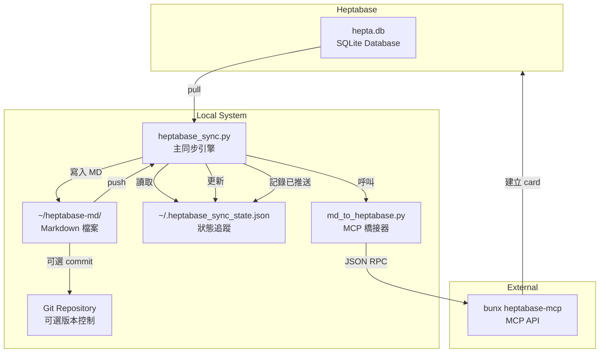
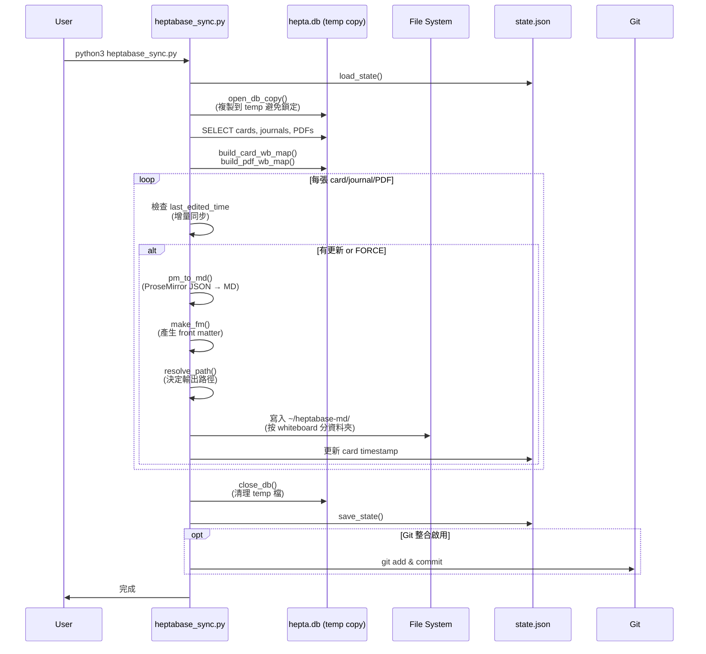
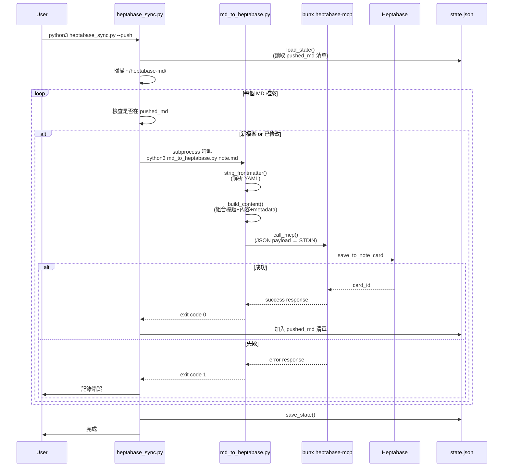
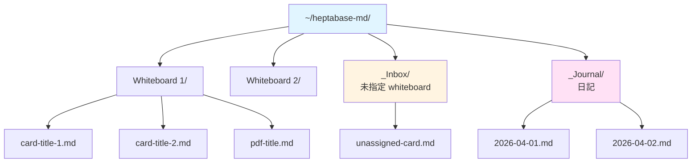
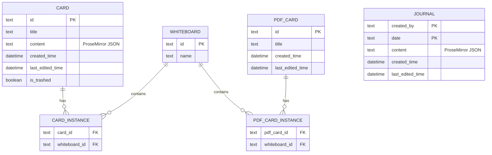

# hepta-md-sync

供 Heptabase ↔ 本地 Markdown 雙向同步工具。

## 快速開始

### 初次設定

1. **複製環境變數範本**
```bash
cp .env.template .env
```

2. **編輯 .env 設定實際路徑**
```bash
# 預設值通常不需修改，除非有自訂路徑需求
# 路徑支援 ~ 代表家目錄
nano .env
```

3. **主要可配置項目**
- `HEPTA_DB_PATH` - Heptabase 資料庫位置
- `OUTPUT_DIR` - Markdown 輸出目錄
- `MCP_BRIDGE_PATH` - MCP 橋接器腳本路徑
- `GIT_COMMIT` - 是否自動 git commit (true/false)

### 檔案位置
`~/Dropbox/6_digital/hepta-md-sync/`

### 常用指令
```bash
python3 heptabase_sync.py              # Heptabase → MD
python3 heptabase_sync.py --push       # MD → Heptabase
python3 heptabase_sync.py --both       # 兩個方向
python3 heptabase_sync.py --dry-run    # 測試，不寫檔
python3 heptabase_sync.py --force      # 強制全量同步
```

### 資料來源與輸出
- **來源**: `~/Library/Application Support/project-meta/hepta.db` (SQLite)
- **輸出**: `~/heptabase-md/`
  - 依 Whiteboard 名稱建子資料夾
  - `_Inbox/` 放未歸屬的 card
  - `_Journal/` 放 journal

### 排程
launchd 每小時自動 pull。手動觸發: `launchctl start com.heptabase.sync`

### 狀態檔
`~/.heptabase_sync_state.json` - 記錄 card 最後編輯時間（增量用）與已推送的 md 路徑清單

---

## 系統架構

### 整體架構圖



### Pull 流程 (Heptabase → Markdown)



### Push 流程 (Markdown → Heptabase)



### 檔案組織結構



---

## 技術細節

### 模組職責

#### heptabase_sync.py (主同步引擎)
- **Pull 功能**
  - `open_db_copy()` - 複製 SQLite DB 到 temp 避免鎖定
  - `build_card_wb_map()` / `build_pdf_wb_map()` - 建立 card/PDF 與 whiteboard 映射
  - `pull_heptabase_to_md()` - 主流程
  - `pm_to_md()` / `content_to_md()` - ProseMirror JSON → Markdown 轉換
  - `make_fm()` - 產生 YAML front matter
  - `resolve_path()` - 決定輸出路徑

- **Push 功能**
  - `push_md_to_heptabase()` - 掃描新/改過的 MD 檔
  - 透過 subprocess 呼叫 `md_to_heptabase.py`

- **狀態管理**
  - `load_state()` / `save_state()` - 序列化到 `~/.heptabase_sync_state.json`

#### md_to_heptabase.py (MCP 橋接器)
- `strip_frontmatter()` - 提取 YAML front matter
- `build_content()` - 組合標題+內容+metadata
- `call_mcp()` - 呼叫 `bunx heptabase-mcp` 推送

### 資料庫 Schema



### 狀態檔結構

```json
{
  "cards": {
    "card_id_1": "2026-04-15T10:30:00",
    "pdf:pdf_id_2": "2026-04-14T15:20:00",
    "journal:user:2026-04-01": "2026-04-01T08:00:00"
  },
  "pushed_md": [
    "/Users/.../note1.md",
    "/Users/.../note2.md"
  ]
}
```

---

## 關鍵設計

### 資料流向
- **Pull**: `hepta.db` → SQLite 查詢 → ProseMirror JSON → Markdown 轉換 → 檔案系統 → (可選) Git
- **Push**: Markdown 檔案 → 解析 → MCP JSON payload → `bunx heptabase-mcp` → Heptabase API → 建立 card

### 設計決策
1. **DB 安全讀取** - 複製到 temp 避免鎖定主 DB
2. **增量同步** - state.json 追蹤時間戳,只處理變更
3. **模組分離** - 主引擎 vs MCP 橋接器,職責清晰
4. **錯誤容錯** - 單一檔案失敗不影響整體流程
5. **CLI 彈性** - 支援 pull/push/both/dry-run/force 多種模式

### 限制與權衡
- **Push 限制**: MCP `save_to_note_card` 只能建立到 Inbox,無法指定 whiteboard,需手動拖移
- **依賴**: 需要 bun (`brew install bun`)
- **PDF**: 不同步內容,只有 metadata
- **圖片**: 不處理附件
- **衝突**: 以 Heptabase 為準,無雙向合併

---

## 技術棧
- **Python 3.14** - 純標準庫 (sqlite3, json, subprocess, pathlib)
- **SQLite** - 直接讀 `hepta.db`
- **Bun** - 執行 MCP bridge (`bunx heptabase-mcp`)
- **launchd** - 排程自動 pull
- **Git** (可選) - 版本控制產生的 Markdown

## 環境變數設定

專案使用 `.env` 檔案管理配置,避免硬編碼路徑。

### 可配置項目
詳見 `.env.template` 範本檔案:

| 變數名 | 說明 | 預設值 |
|--------|------|--------|
| `HEPTA_DB_PATH` | Heptabase SQLite 資料庫路徑 | `~/Library/Application Support/project-meta/hepta.db` |
| `OUTPUT_DIR` | Markdown 輸出目錄 | `~/heptabase-md` |
| `ORPHAN_DIR` | 未歸屬 card 資料夾名稱 | `_Inbox` |
| `GIT_COMMIT` | 是否自動 git commit | `true` |
| `STATE_FILE` | 狀態檔路徑 | `~/.heptabase_sync_state.json` |
| `LOG_FILE` | 日誌檔路徑 | `~/Library/Logs/heptabase_sync.log` |
| `MCP_BRIDGE_PATH` | MCP 橋接器腳本路徑 | `~/Dropbox/6_digital/heptabase-sync/md_to_heptabase.py` |
| `MCP_COMMAND` | MCP 執行指令 | `bunx heptabase-mcp` |

### 注意事項
- `.env` 檔案已加入 `.gitignore`,不會被版本控制
- 路徑支援 `~` 代表家目錄
- 布林值用 `true`/`false` (小寫)

## 詳細文件
- 技術協作文件: `agent.md`